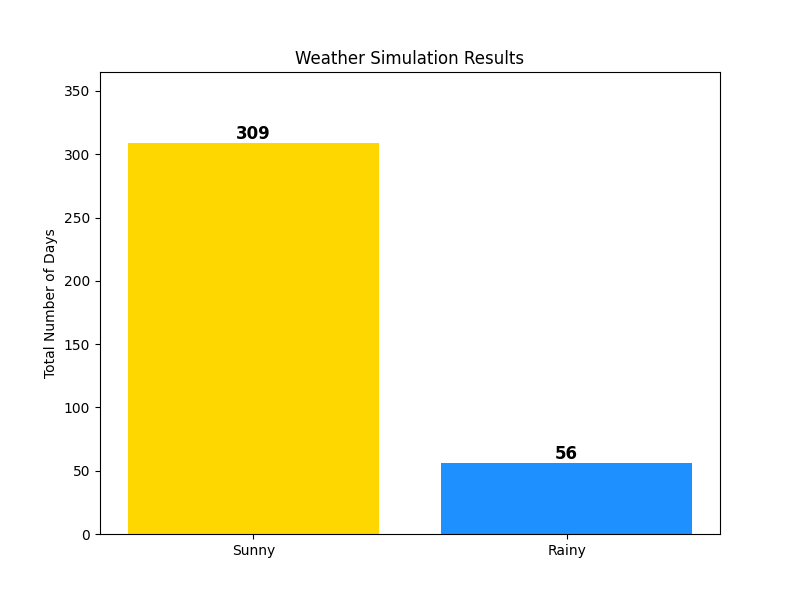
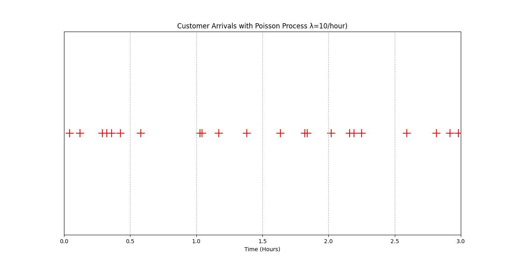
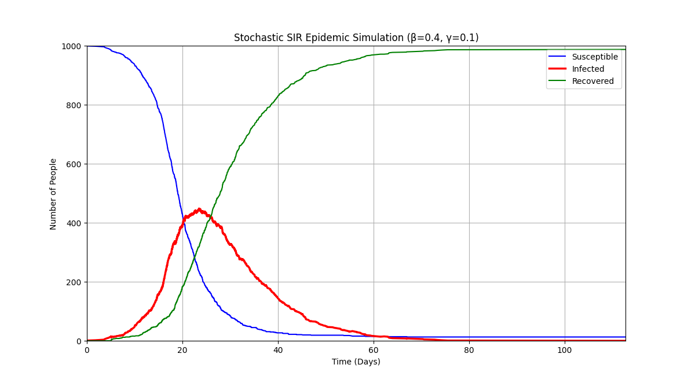

# Project 1: 1D Random Walk Simulation

This project is a simple yet powerful introduction to the world of **stochastic modelling**. It simulates a "Drunkard's Walk," a classic example of a **random walk**, which is a path consisting of a succession of random steps.

This simulation tracks the position of a particle (or our drunkard) on a 1D line over a set number of time steps. We explore two scenarios:
1.  **An Unbiased Walk:** The particle has an equal 50/50 chance of moving left (-1) or right (+1).
2.  **A Biased Walk:** The particle is more likely to move in one direction than the other, demonstrating how a simple bias can dramatically affect the long-term outcome.

This project was built as a foundational step in learning about stochastic processes, a key concept in fields like finance, biology, physics, and engineering.

## Sample Output

Here is a sample visualisation generated by the script. Notice how the biased walk has a clear upward trend, while the unbiased walk ends up in a random position centred around the start.

#### Biased Walk (70% chance of moving right)

 

## Core Concepts Illustrated

*   **Stochastic Process:** A system that evolves in a way that has inherent randomness. You can't predict the exact outcome, only the probability of different outcomes.
*   **Random Walk:** The path traced by a point that takes successive random steps. Our simulation is a **Discrete-Time Markov Process**.
*   **Bias:** A small change in probabilities (`p=[0.3, 0.7]` instead of `p=[0.5, 0.5]`) that leads to a predictable long-term drift, demonstrating that "random" doesn't always mean "no direction."


# Project 2: Weather Simulation with a Markov Chain

This project simulates daily weather patterns using a **Markov Chain**, a fundamental model in the study of **stochastic systems**. The model predicts tomorrow's weather based *only* on today's weather, demonstrating the "memoryless" property of Markovian processes.

The system has two states: **"Sunny"** and **"Rainy"**. A predefined probability matrix governs the transitions between these states. By simulating the weather for a full year (365 days), we can observe the long-term behaviour and stability of the system.

## Simulation Output

The script generates a bar chart summarising the total number of sunny and rainy days over the simulated period. The exact numbers will vary slightly with each run due to the random nature of the simulation, but they will tend toward a stable distribution.



## Core Concepts

*   **Markov Chain:** A model describing a sequence of possible events in which the probability of each event depends only on the state attained in the previous event.
*   **States:** The distinct conditions the system can be in ("Sunny", "Rainy").
*   **Transition Matrix:** The matrix of probabilities that defines the rules for moving from one state to another.
*   **Stationary Distribution:** The simulation reveals that even with daily randomness, the long-term proportion of sunny and rainy days tends to be stable. This is a key feature of many Markov chains.

# Project 3: Customer Arrival Simulation with a Poisson Process

This project models a real-world scenario of random events occurring over time: customers arriving at a coffee shop. It demonstrates the implementation of a **Poisson Process**, a fundamental model in stochastic systems used for events that happen at a constant average rate but at random intervals.

Instead of fixed time-steps, this simulation operates in **continuous time**. The core of the model is the insight that the waiting time between consecutive events in a Poisson process follows an **Exponential Distribution**. By repeatedly generating random waiting times, we can construct a complete timeline of arrivals.

## Simulation Output

The script simulates customer arrivals over a 3-hour period, assuming an average arrival rate of 10 customers per hour. The output is a timeline visualizing the exact, random moment each customer arrived.

Notice that the arrivals are clustered randomly—some are close together, while others have long gaps. This is the characteristic behaviour of a Poisson process.



## Core Concepts Illustrated

*   **Poisson Process:** The premier model for analysing the timing of random, independent events that occur at a known average rate (λ).
*   **Continuous-Time Modelling:** A leap from discrete-step models (like daily weather changes) to systems where events can happen at any moment.
*   **Exponential Distribution:** The probability distribution that describes the time between events in a Poisson process. The simulation's engine is built on generating random numbers from this distribution.
*   **Time-Based Simulation:** The use of a `while` loop that advances a simulation clock, which is a powerful technique for modelling dynamic systems that don't conform to fixed intervals.

# Project 4: Stochastic SIR Epidemic Simulation

This capstone project implements a sophisticated, event-driven simulation of an epidemic spreading through a population. It synthesizes the concepts from previous projects—discrete states, probabilistic transitions, and continuous-time random events—into a single, powerful model.

The simulation is based on the classic **SIR model** of epidemiology and is powered by the **Gillespie Algorithm**, a cornerstone method for stochastic simulation in computational biology and chemistry.

## The SIR Model

Individuals in the population can exist in one of three states:
*   **S**usceptible: Healthy individuals who can contract the disease.
*   **I**nfected: Individuals who have the disease and can transmit it.
*   **R**ecovered: Individuals who have recovered and are now immune.

Two key events drive the system's dynamics: **Infection** (S → I) and **Recovery** (I → R).

## The Simulation Engine: The Gillespie Algorithm

Unlike simpler time-stepped models, this simulation is event-driven. It uses the Gillespie Algorithm to determine the exact, random time of the next event. The algorithm repeatedly answers two questions:

1.  **When will the next event happen?** The time until the next event (either an infection or a recovery) is drawn from an exponential distribution whose rate is the sum of all possible event rates.
2.  **Which event will it be?** A probabilistic choice is made between an infection and a recovery, with the likelihood of each based on its relative rate.

This approach creates a more realistic and computationally efficient simulation of the underlying stochastic process.

## Simulation Output

The script generates the classic epidemic curve, showing the number of individuals in each compartment (S, I, R) over time. The stochastic nature means that each run produces a slightly different curve, mirroring the randomness of a real-world outbreak.



## Core Concepts Implemented

*   **SIR Model:** Application of a fundamental epidemiological model.
*   **Gillespie Algorithm:** A powerful and widely used algorithm for exact stochastic simulation.
*   **Event-Driven Simulation:** A more advanced simulation paradigm compared to fixed time-stepping.
*   **Emergent Behaviour:** The classic epidemic curve is not explicitly programmed; it *emerges* naturally from the simple, local rules of interaction between individuals.

## Understanding the Epidemic Threshold (R₀)

The model's behaviour is critically dependent on its parameters, `beta` (transmission rate) and `gamma` (recovery rate). Their ratio defines the **Basic Reproduction Number**, `R₀ = β / γ`.

*   If **R₀ > 1**, an outbreak will occur.
*   If **R₀ < 1**, the infection will die out without causing a major epidemic.

By experimenting with these parameters (e.g., lowering `beta`), the simulation correctly demonstrates this threshold behaviour, providing a hands-on understanding of a key concept in epidemiology.

## How to Run

### Prerequisites
- Python 3
- NumPy
- Matplotlib

### Installation
Open your terminal and install the required packages:
```bash
pip install numpy matplotlib
