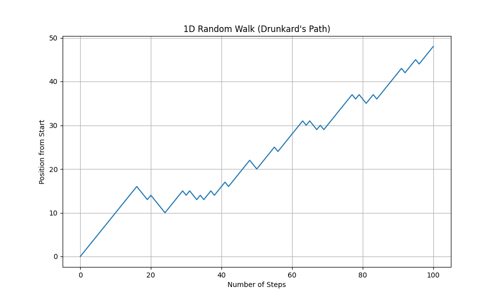

# Project 1: 1D Random Walk Simulation

This project is a simple yet powerful introduction to the world of **stochastic modelling**. It simulates a "Drunkard's Walk," a classic example of a **random walk**, which is a path consisting of a succession of random steps.

This simulation tracks the position of a particle (or our drunkard) on a 1D line over a set number of time steps. We explore two scenarios:
1.  **An Unbiased Walk:** The particle has an equal 50/50 chance of moving left (-1) or right (+1).
2.  **A Biased Walk:** The particle is more likely to move in one direction than the other, demonstrating how a simple bias can dramatically affect the long-term outcome.

This project was built as a foundational step in learning about stochastic processes, a key concept in fields like finance, biology, physics, and engineering.

## Sample Output

Here is a sample visualisation generated by the script. Notice how the biased walk has a clear upward trend, while the unbiased walk ends up in a random position centred around the start.

#### Biased Walk (70% chance of moving right)

 

## Core Concepts Illustrated

*   **Stochastic Process:** A system that evolves in a way that has inherent randomness. You can't predict the exact outcome, only the probability of different outcomes.
*   **Random Walk:** The path traced by a point that takes successive random steps. Our simulation is a **Discrete-Time Markov Process**.
*   **Bias:** A small change in probabilities (`p=[0.3, 0.7]` instead of `p=[0.5, 0.5]`) that leads to a predictable long-term drift, demonstrating that "random" doesn't always mean "no direction."

## Getting Started

To run this simulation on your machine, follow these steps.

### Prerequisites

You will need Python 3 and the following libraries installed:
*   NumPy
*   Matplotlib

### Installation

1.  Clone this repository to your local machine (or just download the `random_walk.py` file).
2.  Open a terminal or command prompt and install the necessary libraries using `pip`:
    ```bash
    pip install numpy matplotlib
    ```

## Running the Simulation

Navigate to the project directory in your terminal and run the Python script:
```bash
python random_walk.py
